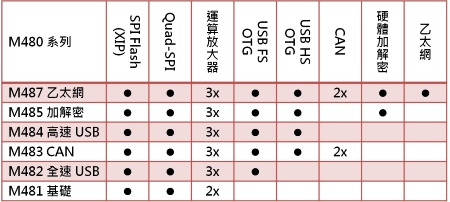

# [M480](https://github.com/sochub/M480) 
 
####  qitas@qitas.cn
#### 父级：[nuvoton](https://github.com/sochub/nuvoton)
#### 归属：[Cortex-M4](https://github.com/sochub/CM4) 
### [芯片简介](https://github.com/sochub/M480/wiki)

NuMicro™ M480 系列：192 MHz CPU、高达512 KB双区块 (dual bank) Flash记忆体、高达160 KB的SRAM 记忆体、支持就地执行 (XIP) 的Quad-SPI界面与16位元I80模式QVGA LCD。

 

* M481 – 192 MHz PWM、2组200 Mbps SDHC、每秒采样5百万次的ADC及每秒1百万次转换率的DAC。
* M482 – USB 2.0 全速device/host/OTG 且内建物理层与1 KB数据缓冲区。
* M483 – 2组CAN 2.0B界面、两组USB支持高速 OTG与全速OTG。
* M484 – USB 2.0 高速device/host/OTG并内建物理层与4 KB数据缓冲区、USB 2.0 全速device/host/OTG 且内建物理层与1 KB数据缓冲区。
* M485 – 硬件加解密引擎包含ECC-256、AES-256、SHA-512、乱数产生器与2组USB 2.0 device/host/OTG。
* M487 – 10/100M 以太网MAC提供RMII/MDC/MDIO接口、硬件加解密引擎、2组CAN 2.0B界面与2组 USB 2.0 device/host/OTG。

### [收录资源](https://github.com/sochub/M480)

* [参考文档](docs/)
* [参考资源](src/)
* [模板工程](demo/)
* [编译工具](https://github.com/sochub/arm-none-eabi)

### [替换方案](https://github.com/sochub/M480)

* 向下替换方案 [Nano100](https://github.com/sochub/Nano100) 
* 同级替换方案 [STM32F4](https://github.com/sochub/STM32F4) 
* 向上替换方案 [STM32H7](https://github.com/sochub/STM32H7) 

##  [SoC资源平台](http://www.qitas.cn)

